## 👋 Hi, I'm Oscar
> Developer based in Paris. My work focuses on clean software architecture, full-stack web development, and data science.

CEO at [weblane](https://markdownlivepreview.com/), we build websites and design automation workflows to help businesses streamline their operations.

```js
export const oboutarf = {
  first_name: "Oscar",
  last_name: "Boutarfa",  
  phone: "0758233600",
  phoneIndic: "+33",
  funFact: "Debugging like a beast",
  location: {
    description: "Paris, Île-de-France",
    coordinates: {
      lat: 19.741755,
      lng: -155.844437
    }
  }
};
```

## My skills
> Only stacks I'm fully proficient in are listed. Any technologies I'm not 100% confident with have been intentionally omitted.


### Front-end

React JS, Next JS, Vue JS, HTML, CSS  

### Back-end

Node JS, Express JS, Python

### Databases

PostgreSQL, MongoDB, GraphQL

### Programming Languages

C, C++, Java, Rust

### Devops

Docker, Github Actions, Linux, AWS

### CRM

Hubspot, Salesforce

### CMS

Wordpress, Shopify

### Cloud

Vercel, AWS, Supabase, Firebase

## What I've Built
> Showcasing a curated portfolio of projects crafted during my time at 42, in professional roles, and through freelance engagements.

### Myhander
<div>
  
</div>

[](#)
[](#)
[](#)
[](#)
[](#)
[](#)

### Kouer
<div>
  
</div>

[](#)
[](#)
[](#)
[](#)
[](#)
[](#)
[](#)


### Weblane
<div>
  
</div>

[](#)
[](#)
[](#)
[](#)
[](#)

### Spora
<div>
  
</div>

[](#)
[](#)
[](#)
[](#)
[](#)
[](#)
[](#)

### Intiviae
<div>
  
</div>

[](#)
[](#)
[](#)
[](#)
[](#)
[](#)
[](#)
[](#)

### PGM Real Estate Dubaï
<div>
  
</div>
  
[](#)
[](#)
[](#)
[](#)

### Majorsmoker
<div>
  
</div>

[](#)
[](#)
[](#)
[](#)
[](#)
[](#)

## Github activity



